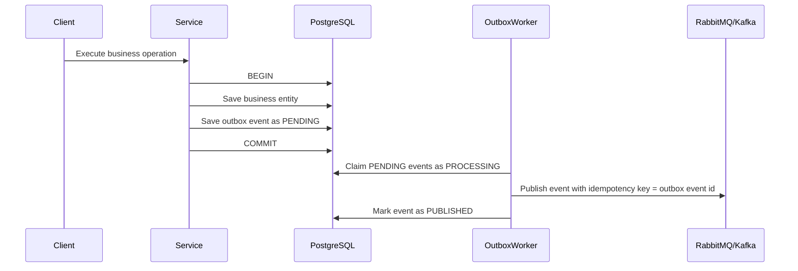

# Transactional Outbox Pattern

## Definition

Transactional Outbox is a reliability pattern used when a service must persist business data and publish an integration event. Instead of saving the entity and publishing directly to RabbitMQ or Kafka in the same request, the service saves the entity and an `outbox_events` row in the same PostgreSQL transaction. A background worker publishes the event after the transaction commits.

## Problem Solved

Without an outbox, a service can commit business data and then fail before publishing the event. The opposite can also happen: the event can be published, but the database transaction can fail. Both cases create inconsistent distributed state.

The outbox solves this by making the database commit the source of truth. If the transaction commits, the event exists and will be published later. If the transaction rolls back, neither the business data nor the event exists.

## ACID Explanation

The service writes two records inside one PostgreSQL transaction:

1. The business entity, such as an incident, loan, user, notification, transport update, or space availability change.
2. The outbox event that describes the integration event to publish.

PostgreSQL provides ACID guarantees:

- Atomicity: both writes commit or both writes roll back.
- Consistency: domain constraints and outbox constraints are checked together.
- Isolation: other transactions do not see partial state.
- Durability: once committed, business data and the outbox event survive process crashes.

## Flow Diagram



## Outbox Table

Each service database that produces events owns its own table:

| Column | Purpose |
| --- | --- |
| `id` | Unique event id and idempotency key. |
| `aggregate_id` | Business entity id. |
| `aggregate_type` | Business entity type. |
| `event_type` | Integration event name. |
| `payload` | JSON payload to publish. |
| `status` | `PENDING`, `PROCESSING`, `PUBLISHED`, or `FAILED`. |
| `retry_count` | Number of failed publish attempts. |
| `max_retries` | Maximum allowed attempts before failure. |
| `error_message` | Last publish error. |
| `created_at` | Creation timestamp. |
| `processed_at` | Published or failed timestamp. |
| `updated_at` | Last update timestamp. |

## Services Using It

Use Transactional Outbox only in services that produce integration events:

| Service | Use Outbox? | Reason |
| --- | --- | --- |
| `auth-service` | Yes | Publishes user lifecycle events. |
| `campus-incident-service` | Yes | Publishes incident lifecycle events. |
| `library-service` | Yes | Publishes loan events. |
| `notification-service` | Yes, if it produces events | Use it for `notification.created` or downstream notification events. |
| `announcement-service` | Yes, if implemented | Publishes announcement events. |
| `event-service` | Yes, if implemented | Publishes campus event events. |
| `transport-service` | Yes, if it publishes events | Publishes transport updates. |
| `space-availability-service` | Yes, if it publishes events | Publishes availability changes. |
| `qr-access-service` | No by default | Current checkout does not publish integration events. |

## Events Produced

RabbitMQ events:

- `user.registered`
- `incident.created`
- `library.loan.created`
- `notification.created`

Kafka events:

- `announcement.created`
- `campus.event.created`
- `transport.updated`
- `space.availability.changed`

## RabbitMQ and Kafka Integration

The outbox worker does not need to know business rules. It reads pending rows and delegates publishing to a broker-specific publisher.

RabbitMQ publisher behavior:

- Map `user.registered`, `incident.created`, `library.loan.created`, and `notification.created` to RabbitMQ routing keys.
- Include `outboxEvent.id` as the idempotency key or message id.
- Consumers should deduplicate by message id when possible.

Kafka publisher behavior:

- Map `announcement.created`, `campus.event.created`, `transport.updated`, and `space.availability.changed` to Kafka topics.
- Use `aggregateId` as the Kafka key when events for the same aggregate must preserve order.
- Include `outboxEvent.id` in headers for idempotency.

## Failure Scenarios

| Scenario | Result |
| --- | --- |
| Business transaction fails | Business entity is not saved and outbox event is not saved. |
| Service crashes after commit | Outbox event remains `PENDING` and is published when the worker runs. |
| Broker is unavailable | Worker increments `retry_count` and returns the event to `PENDING`. |
| Max retries exceeded | Worker marks the event as `FAILED` and stores `error_message`. |
| Worker publishes but crashes before marking `PUBLISHED` | Event can be retried, so consumers must be idempotent. |

## Benefits

- Prevents lost events after successful database commits.
- Keeps business writes and event creation atomic.
- Removes distributed transaction requirements between PostgreSQL and RabbitMQ/Kafka.
- Supports retries and failure visibility.
- Improves observability with metrics, logs, and health information.
- Allows progressive adoption per service without breaking existing endpoints.

## Implementation Example

```ts
await this.outboxService.runInTransaction(async (manager) => {
  const incident = manager.create(Incident, dto);
  const savedIncident = await manager.save(incident);

  await this.outboxService.saveEvent(
    {
      aggregateId: savedIncident.id,
      aggregateType: 'Incident',
      eventType: 'incident.created',
      payload: {
        id: savedIncident.id,
        title: savedIncident.title,
        severity: savedIncident.severity,
        createdAt: savedIncident.createdAt,
      },
    },
    manager,
  );

  return savedIncident;
});
```
